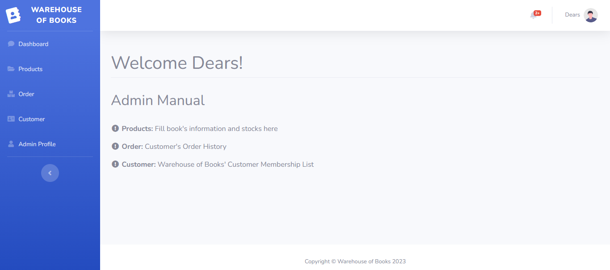
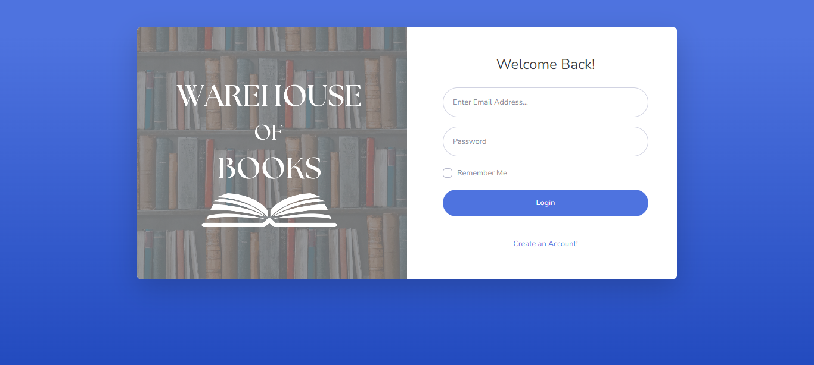

<h1>WAREHOUSE OF BOOKS</h1>

## Anggota Kelompok

*Pemrograman Website - C*
1. Saqina Salsabila Larasati    -   [215150200111070]
2. Nadhira Nurannisa            -   [215150207111017]
3. Julia Nur Fajrina            -   [215150201111039]
4. Verizca Maudia Putri         -   [215150207111088]

## Tugas Akhir Pemrograman Web
Nama Website : Warehouse of Books

Warehouse of Books adalah sebuah website yang dirancang khusus untuk membantu admin dalam mengatur dan mengelola ketersediaan buku di sebuah toko buku. Website ini memberikan kemudahan bagi admin untuk mengecek ketersediaan buku, melihat data customer yang merupakan member, dan riwayat order buku dari customer. Website ini dirancang untuk satu peran utama, yaitu Admin, dengan fitur-fitur yang disesuaikan sesuai peran.

### Role Admin:
-Dashboard

Sebagai admin di Warehouse of Books, Pengguna memiliki akses penuh untuk mengelola ketersediaan buku. Berikut adalah fitur-fitur yang tersedia untuk Pengguna:
- Register : Fitur Register akan membutuhkan nama, email, dan password agar bisa menjadi admin.
- Login: Fitur Login pada admin memungkinkan admin untuk langsung tertuju ke halaman dashboard dengan menu Dashboard, Products, Order, Customer, dan Admin Profile.
- Manajemen Tabel Customer : Pengguna dapat melakukan operasi CRUD (Create, Read, Update, Delete) terhadap data customer. Pengguna dapat menambah customer, melihat daftar customer, mengubah informasi customer, dan menghapus data customer jika itu diperlukan.
- Manajemen Tabel Product : Pengguna dapat melakukan operasi CRUD (Create, Read, Update, Delete) terhadap data buku. Pengguna dapat menambahkan buku, melihat daftar buku, mengubah informasi buku, dan menghapus data buku jika itu diperlukan.
- Manajemen Tabel Order : Pengguna dapat melihat semua order dari customer.
- Manajemen Tabel Order Detail : Pengguna dapat melihat order dari setiap customer secara detail.

Warehouse of Books membantu mempercepat dan mengoptimalkan proses pengecekan ketersediaan buku. Dengan fitur-fitur yang disesuaikan untuk admin, website ini memudahkan koordinasi antara toko buku dan admin untuk memastikan pengalaman yang baik dalam melihat berbagai data.

## Lampiran Screenshot
1. Register

2. Login

3. Produk/List Buku

5. Tabel Pelanggan/Member

7. Tabel Riwayat Order

9. Setting Profile Admin

## Installation
- `git clone <URL HTTPS Github>`
- `cd .../WarehouseofBook-main`
- `composer install`
- `cp .env.example .env`
- Ubah ke `.env`
- `php artisan key:generate`
- Buat database `laravel` di PHP MyAdmin
- `php artisan migrate`
- `php artisan db:seed`
